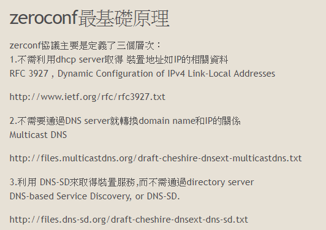

### [What's ZeroConf](https://www.google.com/search?lr=lang_zh-CN%7Clang_zh-TW&biw=1490&bih=1126&tbs=lr%3Alang_1zh-CN%7Clang_1zh-TW&ei=5wqbXOThOu6OggelvYLwCw&q=android+zeroconf&oq=android+zeroconf&gs_l=psy-ab.3..35i39j0i203j0i30l3j0i5i30j0i8i30l4.2260798.2266213..2266949...0.0..0.51.672.16....3..0....1..gws-wiz.......0i67j0i131j0j0i10i203.CxD4PjT1-7w)

 - [zeroconf研究筆記(1) ——zeroconf初步認識](https://www.itread01.com/content/1550453969.html)

    

 - [區域網設備發現之Bonjour協議](https://kknews.cc/zh-tw/tech/o4ybmm.html)

 

### Android ZeroConf

- [Bonjour Android, it's ZeroConf - Roberto Orgiu](https://www.youtube.com/watch?v=QQHayKnLfP8)  
  [Bonjour Android, it’s Zeroconf](https://medium.com/@_tiwiz/bonjour-android-its-zeroconf-8e3d3fde760e)

- [Android 中 Bonjour 通信的最佳方式](http://smallzhan.github.io/android/2015/12/24/p-android-bonjour.html)

#### 三種實現

 - [Android NsdService](https://developer.android.com/training/connect-devices-wirelessly/nsd)

 - Java JMDNS

 - Apple Bonjour :
   - [Bonjour in Android Applications](https://www.andriydruk.com/post/mdnsresponder/)
     - [andriydruk/BonjourBrowser](https://github.com/andriydruk/BonjourBrowser)
     - [andriydruk/RxDNSSD](https://github.com/andriydruk/RxDNSSD)
     - [Service Browser in Google Play Store](https://play.google.com/store/apps/details?id=com.druk.servicebrowser&hl=en)

#### AOSP's implementation :

 - [NsdService](http://androidxref.com/9.0.0_r3/search?q=NsdService&defs=&refs=&path=-%22.+jar%22&hist=&project=art&project=bionic&project=bootable&project=build&project=compatibility&project=cts&project=dalvik&project=developers&project=development&project=device&project=external&project=frameworks&project=hardware&project=kernel&project=libcore&project=libnativehelper&project=packages&project=pdk&project=platform_testing&project=prebuilts&project=sdk&project=system&project=test&project=toolchain&project=tools)

 - [mdnsresponder](mdnsresponder)